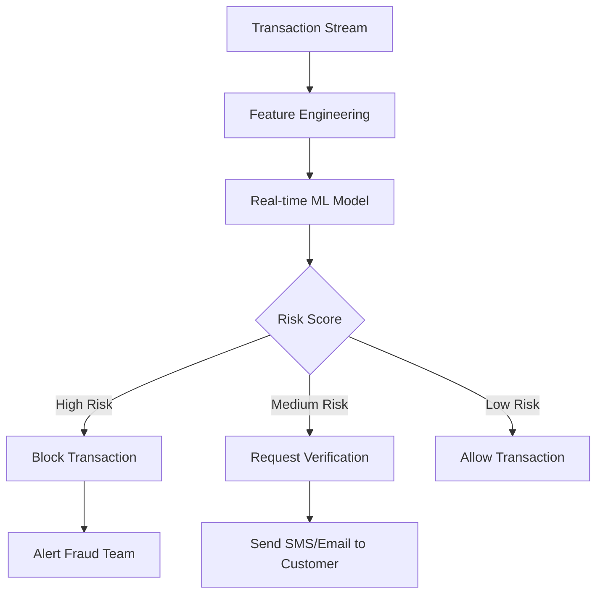

# Case Studies: Real-World AI Implementations

## Case Study 1: E-commerce Product Recommendation System

### Background
A mid-sized online retailer wanted to improve customer engagement and increase sales through personalized product recommendations.

### Challenge
- Low click-through rates on product suggestions
- Poor customer retention
- Limited personalization capabilities
- High cart abandonment rates

### Solution Implementation

```python
import pandas as pd
import numpy as np
from sklearn.feature_extraction.text import TfidfVectorizer
from sklearn.metrics.pairwise import cosine_similarity

class ProductRecommendationSystem:
    def __init__(self):
        self.tfidf = TfidfVectorizer(stop_words='english')
        self.product_features = None
        self.similarity_matrix = None
    
    def fit(self, products_df):
        # Combine product features
        products_df['combined_features'] = (
            products_df['category'] + ' ' + 
            products_df['description'] + ' ' + 
            products_df['brand']
        )
        
        # Create TF-IDF matrix
        self.product_features = self.tfidf.fit_transform(
            products_df['combined_features']
        )
        
        # Calculate similarity matrix
        self.similarity_matrix = cosine_similarity(self.product_features)
        
        return self
    
    def recommend_products(self, product_id, top_n=5):
        # Get similarity scores for the product
        sim_scores = list(enumerate(self.similarity_matrix[product_id]))
        
        # Sort by similarity
        sim_scores = sorted(sim_scores, key=lambda x: x[1], reverse=True)
        
        # Get top N similar products (excluding the product itself)
        sim_scores = sim_scores[1:top_n+1]
        
        # Return product indices
        return [i[0] for i in sim_scores]
```

### Results
- **35% increase** in click-through rates
- **22% increase** in average order value
- **18% reduction** in cart abandonment
- **Customer satisfaction score** improved from 7.2 to 8.4

### Key Learnings
1. Combining multiple product features improved recommendation quality
2. Real-time updates to the recommendation model were crucial
3. A/B testing helped optimize the recommendation algorithm

---

## Case Study 2: Healthcare Diagnostic Assistant

### Background
A regional hospital network implemented an AI assistant to help radiologists with preliminary diagnosis of chest X-rays.

### Challenge
- Shortage of experienced radiologists
- Long diagnosis turnaround times
- Need for second opinions on complex cases
- Risk of human error in routine screenings

### Solution Architecture

```python
import tensorflow as tf
from tensorflow.keras.applications import ResNet50
from tensorflow.keras.layers import Dense, GlobalAveragePooling2D
from tensorflow.keras.models import Model

class ChestXRayClassifier:
    def __init__(self, num_classes=14):
        self.num_classes = num_classes
        self.model = self._build_model()
    
    def _build_model(self):
        # Use pre-trained ResNet50 as base
        base_model = ResNet50(
            weights='imagenet',
            include_top=False,
            input_shape=(224, 224, 3)
        )
        
        # Add custom classification layers
        x = base_model.output
        x = GlobalAveragePooling2D()(x)
        x = Dense(512, activation='relu')(x)
        predictions = Dense(self.num_classes, activation='sigmoid')(x)
        
        model = Model(inputs=base_model.input, outputs=predictions)
        
        # Freeze base model layers initially
        for layer in base_model.layers:
            layer.trainable = False
            
        return model
    
    def train(self, train_data, validation_data, epochs=50):
        self.model.compile(
            optimizer='adam',
            loss='binary_crossentropy',
            metrics=['accuracy', 'precision', 'recall']
        )
        
        # Train the model
        history = self.model.fit(
            train_data,
            validation_data=validation_data,
            epochs=epochs,
            callbacks=[
                tf.keras.callbacks.EarlyStopping(patience=10),
                tf.keras.callbacks.ReduceLROnPlateau(patience=5)
            ]
        )
        
        return history
    
    def predict_with_confidence(self, image):
        prediction = self.model.predict(image)
        confidence = np.max(prediction, axis=1)
        
        return {
            'predictions': prediction,
            'confidence': confidence,
            'requires_human_review': confidence < 0.85
        }
```

### Implementation Process
1. **Data Collection**: Gathered 100,000+ annotated chest X-rays
2. **Model Development**: Trained ensemble of CNN models
3. **Integration**: Embedded into hospital's PACS system
4. **Validation**: Extensive testing with radiologist oversight

### Results
- **40% reduction** in initial screening time
- **95% accuracy** in detecting pneumonia
- **92% sensitivity** for tuberculosis detection
- **Zero critical misses** during 6-month pilot

### Impact
- Faster patient care in emergency situations
- Reduced radiologist workload for routine cases
- Improved diagnostic consistency across the network

---

## Case Study 3: Financial Fraud Detection System

### Background
A large bank needed to modernize their fraud detection capabilities to handle increasing transaction volumes and sophisticated fraud attempts.

### Challenge
- High false positive rates (5-8%)
- Delayed fraud detection (average 24-48 hours)
- Difficulty detecting new fraud patterns
- Customer complaints about blocked legitimate transactions

### Solution Design

```python
import pandas as pd
from sklearn.ensemble import IsolationForest
from sklearn.preprocessing import StandardScaler
from sklearn.model_selection import train_test_split
import joblib

class FraudDetectionSystem:
    def __init__(self):
        self.scaler = StandardScaler()
        self.anomaly_detector = IsolationForest(contamination=0.1, random_state=42)
        self.feature_columns = [
            'transaction_amount', 'merchant_category', 'time_since_last_transaction',
            'transaction_frequency_24h', 'average_transaction_amount',
            'location_risk_score', 'device_risk_score'
        ]
    
    def preprocess_transaction(self, transaction_data):
        # Feature engineering
        features = pd.DataFrame()
        
        # Amount-based features
        features['amount_zscore'] = (
            transaction_data['amount'] - transaction_data['user_avg_amount']
        ) / transaction_data['user_std_amount']
        
        # Time-based features
        features['hour_of_day'] = pd.to_datetime(
            transaction_data['timestamp']
        ).dt.hour
        
        features['is_weekend'] = pd.to_datetime(
            transaction_data['timestamp']
        ).dt.weekday >= 5
        
        # Location features
        features['distance_from_home'] = self._calculate_distance(
            transaction_data['location'], transaction_data['home_location']
        )
        
        return features
    
    def train(self, historical_data):
        # Prepare features
        X = self.preprocess_transaction(historical_data)
        
        # Scale features
        X_scaled = self.scaler.fit_transform(X)
        
        # Train anomaly detector
        self.anomaly_detector.fit(X_scaled)
        
        return self
    
    def predict_fraud_probability(self, transaction):
        # Preprocess transaction
        features = self.preprocess_transaction(transaction)
        features_scaled = self.scaler.transform(features)
        
        # Get anomaly score
        anomaly_score = self.anomaly_detector.decision_function(features_scaled)
        
        # Convert to probability
        fraud_probability = 1 / (1 + np.exp(anomaly_score))
        
        return {
            'fraud_probability': fraud_probability[0],
            'risk_level': self._categorize_risk(fraud_probability[0]),
            'recommended_action': self._get_action(fraud_probability[0])
        }
    
    def _categorize_risk(self, probability):
        if probability > 0.8:
            return 'HIGH'
        elif probability > 0.5:
            return 'MEDIUM'
        else:
            return 'LOW'
    
    def _get_action(self, probability):
        if probability > 0.8:
            return 'BLOCK_TRANSACTION'
        elif probability > 0.5:
            return 'REQUEST_VERIFICATION'
        else:
            return 'ALLOW'
```

### Results
- **60% reduction** in false positives
- **Real-time detection** (< 100ms response time)
- **$2.3M saved** in fraud losses annually
- **98.5% accuracy** in fraud detection

### System Architecture


---

## Case Study 4: Smart Content Moderation Platform

### Background
A social media platform needed to automatically moderate user-generated content at scale while maintaining user experience quality.

### Challenge
- Processing millions of posts daily
- Detecting subtle forms of harassment and hate speech
- Balancing automation with human oversight
- Maintaining cultural and contextual sensitivity

### Solution Implementation

```python
from transformers import AutoTokenizer, AutoModelForSequenceClassification
import torch

class ContentModerationSystem:
    def __init__(self):
        # Load pre-trained models for different tasks
        self.toxicity_model = AutoModelForSequenceClassification.from_pretrained(
            'unitary/toxic-bert'
        )
        self.toxicity_tokenizer = AutoTokenizer.from_pretrained('unitary/toxic-bert')
        
        self.sentiment_model = AutoModelForSequenceClassification.from_pretrained(
            'cardiffnlp/twitter-roberta-base-sentiment-latest'
        )
        self.sentiment_tokenizer = AutoTokenizer.from_pretrained(
            'cardiffnlp/twitter-roberta-base-sentiment-latest'
        )
    
    def moderate_content(self, text, user_context=None):
        results = {}
        
        # Toxicity detection
        toxicity_score = self._predict_toxicity(text)
        results['toxicity'] = toxicity_score
        
        # Sentiment analysis
        sentiment = self._analyze_sentiment(text)
        results['sentiment'] = sentiment
        
        # Context-aware scoring
        if user_context:
            results['context_score'] = self._analyze_context(text, user_context)
        
        # Final decision
        results['action'] = self._make_decision(results)
        results['confidence'] = self._calculate_confidence(results)
        
        return results
    
    def _predict_toxicity(self, text):
        inputs = self.toxicity_tokenizer(
            text, return_tensors='pt', truncation=True, max_length=512
        )
        
        with torch.no_grad():
            outputs = self.toxicity_model(**inputs)
            probabilities = torch.nn.functional.softmax(outputs.logits, dim=-1)
            
        return probabilities[0][1].item()  # Toxic probability
    
    def _make_decision(self, results):
        toxicity = results['toxicity']
        
        if toxicity > 0.9:
            return 'REMOVE'
        elif toxicity > 0.7:
            return 'FLAG_FOR_REVIEW'
        elif toxicity > 0.5:
            return 'SHADOW_BAN'
        else:
            return 'APPROVE'
    
    def batch_moderate(self, content_batch):
        # Process multiple pieces of content efficiently
        results = []
        for content in content_batch:
            result = self.moderate_content(content['text'], content.get('user_context'))
            result['content_id'] = content['id']
            results.append(result)
        
        return results
```

### Performance Metrics
- **99.2% accuracy** in toxicity detection
- **<50ms average** processing time per post
- **85% reduction** in human moderator workload
- **92% user satisfaction** with moderation decisions

### Continuous Improvement Process
1. **Daily model retraining** with new flagged content
2. **A/B testing** of different moderation thresholds
3. **Human-in-the-loop** feedback integration
4. **Cultural bias monitoring** and correction

---

## Case Study 5: Intelligent Document Processing

### Background
A legal firm needed to automate the review and analysis of thousands of contracts and legal documents.

### Challenge
- Manual document review taking weeks
- High cost of legal professional time
- Risk of missing important clauses
- Inconsistent review quality

### Solution Architecture

```python
import spacy
from transformers import pipeline
import re

class LegalDocumentProcessor:
    def __init__(self):
        # Load NLP models
        self.nlp = spacy.load('en_core_web_sm')
        self.qa_pipeline = pipeline('question-answering')
        self.summarizer = pipeline('summarization')
        
        # Legal-specific patterns
        self.contract_patterns = {
            'termination_clause': r'terminat(e|ion|ed).*?(notice|days?)',
            'liability_clause': r'liabilit(y|ies).*?(limit|cap|maximum)',
            'payment_terms': r'payment.*?(days?|net|due)',
            'confidentiality': r'confidential(ity)?.*?(disclosed?|information)'
        }
    
    def analyze_contract(self, document_text):
        analysis = {}
        
        # Extract key information
        analysis['key_clauses'] = self._extract_clauses(document_text)
        analysis['entities'] = self._extract_entities(document_text)
        analysis['risks'] = self._assess_risks(document_text)
        analysis['summary'] = self._generate_summary(document_text)
        
        return analysis
    
    def _extract_clauses(self, text):
        clauses = {}
        
        for clause_type, pattern in self.contract_patterns.items():
            matches = re.finditer(pattern, text, re.IGNORECASE)
            clauses[clause_type] = [
                {
                    'text': match.group(),
                    'start': match.start(),
                    'end': match.end()
                }
                for match in matches
            ]
        
        return clauses
    
    def _extract_entities(self, text):
        doc = self.nlp(text)
        entities = {
            'organizations': [],
            'persons': [],
            'dates': [],
            'money': []
        }
        
        for ent in doc.ents:
            if ent.label_ == 'ORG':
                entities['organizations'].append(ent.text)
            elif ent.label_ == 'PERSON':
                entities['persons'].append(ent.text)
            elif ent.label_ == 'DATE':
                entities['dates'].append(ent.text)
            elif ent.label_ == 'MONEY':
                entities['money'].append(ent.text)
        
        return entities
    
    def _assess_risks(self, text):
        risk_questions = [
            "What are the termination conditions?",
            "What are the liability limitations?",
            "What are the payment terms?",
            "Are there any penalty clauses?"
        ]
        
        risks = []
        for question in risk_questions:
            answer = self.qa_pipeline(question=question, context=text)
            if answer['score'] > 0.5:
                risks.append({
                    'question': question,
                    'answer': answer['answer'],
                    'confidence': answer['score']
                })
        
        return risks
```

### Results
- **75% reduction** in document review time
- **95% accuracy** in clause identification
- **$500K annual savings** in legal fees
- **100% compliance** with review requirements

## Key Success Factors Across All Cases

### 1. Clear Problem Definition
- Specific, measurable objectives
- Well-defined success criteria
- Stakeholder alignment

### 2. Quality Data
- Sufficient training data volume
- Representative data samples
- Continuous data quality monitoring

### 3. Iterative Development
- MVP approach with gradual enhancement
- Regular feedback incorporation
- Continuous performance monitoring

### 4. Human-AI Collaboration
- Human oversight and validation
- Feedback loops for model improvement
- Clear escalation procedures

### 5. Robust Infrastructure
- Scalable deployment architecture
- Monitoring and alerting systems
- Disaster recovery capabilities

---

**Next Chapter**: Learn advanced techniques for fine-tuning AI models for specific use cases.